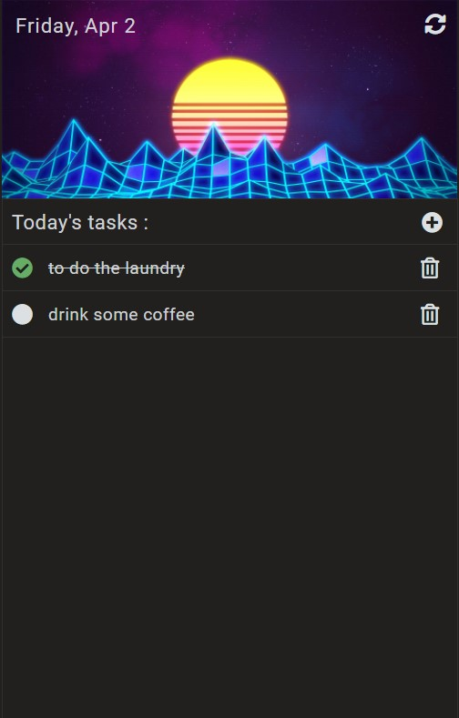

# todo-list
Simple todo list progressive web app i wrote in 2019 to learn the basics of javascript

[todo-list on the Live Demo](https://janskiba.github.io/todo-list/)

What i used:
- js
- css
- html
- PWA

# Features:
- adding and deleting tasks
- displaying current date and day of the week
- checking and unchecking tasks
- simple PWA
- saving tasks to local storage

# Screenshots:
